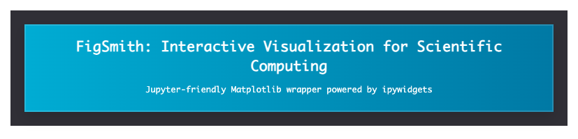

<p align="center">
  
</p>

# FigSmith

Tired of presenting slides with tiny ticks, cramped labels, or mismatched fonts—and then losing time hunting Matplotlib syntax on forums? LLMs can spit out snippets, but you still end up wrangling code blocks and re‑running cells to get the look right. FigSmith trims that loop.

Figsmith is a small, notebook‑native widget that sits on top of Matplotlib and lets you tune figure aesthetics interactively: figure size and DPI, axes labels, tick sizes, legends, colors, line widths, fonts, colormaps, and more—without writing another line of plotting boilerplate. It’s built with ipywidgets, so it runs right where you work: Jupyter.

Who is it for? Researchers, engineers, and students in scientific computing (e.g., fluid dynamics) who want publishable plots, clean lecture or report figures, or quick sanity checks, all inside a notebook. You already have the data; Figsmith helps you style the figure.

What it is (today):
- A thin, Jupyter‑first wrapper around Matplotlib with an interactive UI
- Plot types: line, scatter, contour/tricontour, cylindrical contour, vector fields (quiver) with optional color and overlay
- Works from files (.dat) and in‑memory data (NumPy, Pandas)
- Subplots for multi‑panel figures; LaTeX‑style mathtext labels

Notes and practical tips:
- If a colorbar placement looks off in contour/scatter, toggle its visibility off/on in the controls to re‑flow the layout.
- If you ever see a duplicate static image from a prior run, just re‑run the cell. The widget renders figures inside its own output area to avoid inline accumulation.
- Math text: type the symbol directly (e.g., `\omega`) without surrounding `$...$`. If the expression is invalid, rendering is safely gated—double‑check and re‑apply.
- For complex page layouts, consider exporting and arranging in a design canvas (PowerPoint, Illustrator, Inkscape). Figsmith also supports subplots when you want everything in one figure.

Version: v0.1.0

## Highlights
- Jupyter-first: ipywidgets UI, no boilerplate
- Plot types: line, scatter, contour, tricontour, cylindrical, vector
- Works with files and in-memory data (NumPy, Pandas)
- Per-line and global controls; export to PNG, SVG, PDF, JPG
- Subplots support for multi-panel figures

## Install
```bash
pip install -e .
```

## Quickstart
```python
import figsmith as ff
plotter = ff.load_and_plot('example_data/trig_functions.dat')
```

## In-Memory Data
```python
import numpy as np
import pandas as pd
import figsmith as ff

# DataFrame
df = pd.DataFrame({
    'x': np.linspace(0, 10, 200),
    'sin': np.sin(np.linspace(0, 10, 200)),
    'cos': np.cos(np.linspace(0, 10, 200))
})
ff.load_and_plot(data=df)

# Arrays
x = np.linspace(0, 2*np.pi, 300)
ff.load_and_plot(x=x, y=[np.sin(x), np.cos(x)])
```

## From .dat → NumPy → Pandas → FigSmith
```python
import numpy as np, pandas as pd, figsmith as ff
path = 'example_data/trig_functions.dat'
arr = np.loadtxt(path, skiprows=1)
x, sinx, cosx, sin2x, cos2x = arr.T

# Arrays
ff.load_and_plot(x=x, y=[sinx, cosx, sin2x, cos2x])

# DataFrame
df = pd.DataFrame({'x': x, 'sin(x)': sinx, 'cos(x)': cosx, 'sin(2x)': sin2x, 'cos(2x)': cos2x})
ff.load_and_plot(data=df)
```

## Notebook Demo
Open `examples/unified_plotter_demo.ipynb` in Jupyter and run the cells. It showcases loading from files, arrays, and DataFrames across plot types with the interactive UI.

## Local Setup (cloning this repo)
1. `python3 -m venv figsmith_env`  
   `source figsmith_env/bin/activate`
2. `python -m pip install --upgrade pip setuptools wheel`
3. `python -m pip install -r requirements.txt` *(optional but recommended)*
4. `python -m pip install -e .`
5. Register the kernel:  
   `python -m ipykernel install --user --name figsmith_env --display-name "Figsmith (Python 3.x)"`
6. In notebooks: `Kernel → Change Kernel → Figsmith (Python 3.x)`
7. If you still see `ModuleNotFoundError`, run inside the notebook:  
   `%pip uninstall -y figflow figsmith`  
   `%pip install -e /abs/path/to/figsmith`  
   then restart the kernel.


